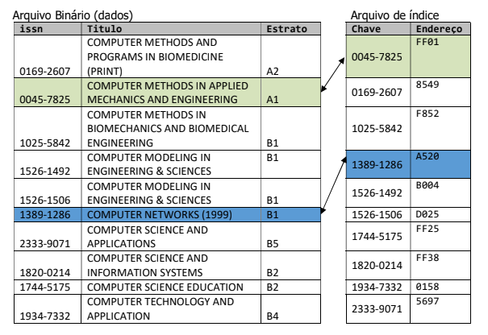

# Indexação de Arquivos
Segundo projeto da disciplina de Estrutura de Dados (Sistemas para Internet, IFPB) feito em 2017.2.

## Descrição
Todo o texto a seguir foi escrito pelos professores da disciplina, Cândido do Egypto e Alex Cunha.
A recuperação de dados em dispositivos de armazenamento permanente, a exemplo do disco rígido, é muito lenta se comparada ao tempo que se levaria para manipular dados em memória. Neste projeto, será implementada uma biblioteca (e programa principal para demonstração das funcionalidades da biblioteca) para demonstrar o funcionamento de técnicas de indexação. Um índice é um mapeamento que associa chave/valor que associa cada chave a uma referência de registro que a contém. Especificamente,  neste projeto, as chaves serão únicas e não nulas de forma a identificar unicamente cada registro. O arquivo binário será povoado com estruturas do tipo qualis, representada pela seguinte estrutura:
```
#define TAM 51 /* Tamanho da String */
typedef struct {
    int issn; /* identificador único da publicação seriada */
    char titulo[TAM]; /* titulo do periodico */
    char estrato[3]; /* Estrato: A1, A2, B1, B2, B3, B4, B5, C */
} periodico;
```
Não há limite quanto ao número de periódicos com qualis (registros) que poderá ser armazenado no arquivo. Se houver necessidade, pode ser acrescentado algum campo de controle à estrutura. O ISSN (International Standard Serial Number), sigla em inglês para Número Internacional Normalizado para Publicações Seriadas, é o código aceito internacionalmente para individualizar o título de uma publicação seriada. Esse número se torna único e exclusivo do título da publicação ao qual foi atribuído. Por ser um código único, o ISSN identifica o título de uma publicação seriada durante todo o seu ciclo de existência (fase de lançamento, circulação e encerramento da revista), seja qual for o idioma ou suporte utilizado (impresso, online, CD-ROM e demais mídias). O ISSN é composto por oito dígitos distribuídos em dois grupos de quatro dígitos cada, separados por um hífen. Exemplo: ISSN 1018-4783. Cada inserção de um novo registro no arquivo de dados implica em uma inserção no índice para sua localização, de modo que tenhamos a seguinte representação ordenada na memória:



Para acessar um determinado registro, para consulta ou alteração, é feita a pesquisa na estrutura de índice para que sua localização no disco seja encontrada e, em seguida, feito o acesso direto para leitura ou gravação. A remoção de um registro do arquivo de dados implica na remoção física do arquivo binário e atualização da estrutura de índices. A implementação da estrutura de índices será apresentada na forma de uma árvore de busca binária (e suas respectivas operações) ou lista encadeada (qualquer que seja o tipo de implementação escolhido) ou hashing. A sistemática que definirá qual Estrutura de Dados cada equipe vai implementar será divulgada pelo professor em sala de aula (esse projeto foi feito com  hashing linear).

O programa principal deve prover acesso a, no mínimo, os seguintes itens de menu:
- (i) Importar arquivo CSV
- (p) Exportar tabela de índice
- (a) Adicionar manualmente um periódico
- (c) Consultar um periódico
- (x) Excluir periódico
- (e) Eliminar todos os periódicos
- (l) Listar dados

A opção Importar arquivo CSV deve permitir a carga de um arquivo texto CSV a partir do disco, constituído pela seguinte sequência de dados: issn, titulo e estrato. Esta ação reconstrói o índice desconsiderando o status atual. O arquivo CSV pode vir com falhas (ISSN duplicado, ISSN fora do formato, títulos com tamanho variados, entre outros). Exiba informações úteis a respeito da tarefa, tais como:
número de registros carregados, tempo de carga da tarefa, log de erros encontrados, altura das subárvores esquerda e direita (no caso de implementação com árvore binária de busca), e outras informações relevantes que a implementação exigir. O arquivo CSV virá com o ISSN formatado da seguinte forma: xxxx-xxxx, onde “x” deve corresponder a um dígito.

A opção Exportar tabela de índice salva o arquivo binário no formato texto, conforme disposição das chaves na tabela de indexação. O arquivo texto terá a seguinte sequência de campos: issn, titulo e estrato.

A opção Adicionar manualmente um periódico possibilita a inclusão manual de um periódico.
A opção Excluir periódico efetua a exclusão de um periódico. 
A opção Consultar periódico exibe os dados de um periódico a partir de uma chave de busca especificada. 
A opção Eliminar todos os periódicos efetua a exclusão de todos os registros no arquivo físico.
A opção Listar dados exibe a lista de periódicos. A lista de periódicos será exibida de acordo com um dos critérios: (a) por ISSN, ou (b) Ordem alfabética do título do periódico.

### Requisitos Não-Funcionais
- Utilização de técnica de busca apropriada para identificar uma chave na tabela de indexação;
- Utilização de algoritmo de classificação apropriado para manter ordenada a tabela de indexação (vai depender da solução utilizada);
- Facilidade de utilização do programa (o programa deve mostrar ao usuário que os requisitos funcionais estão sendo atendidos, sem que seja dado um prévio “treinamento” sobre o funcionamento do programa);
- Interação programa/usuário na exibição das mensagens do sistema (de erro ou de orientação);
- Apresentação de dados de forma organizada, na tela;
